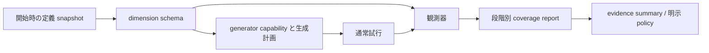

# 汎用 coverage protocol と plist 初期対応の設計

日付: 2026-09-27
状態: レビュー用設計。ここに示す新 API・設定・schema は未実装。
基準: main 98101da（evidence sufficiency を含む PR #36 マージ後）
関連: [Issue #20](https://github.com/masatoi/cl-spec/issues/20)、
[evidence 設計](2026-09-26-evidence-sufficiency-design.md)

## 1. 目的と合意済みの方向性

「何回試したか」だけでなく、「どんな入力条件を、どこまで実際に試したか」を
人間・LLM・MCP consumer が保存済み結果から判断できるようにする。

共通 protocol を core に設け、最初の対応対象を plist とする。
生成能力、実際の観測、明示 policy による充足判定を分離する。
結果の読み出しで target、generator、guard、predicate、reader を再実行しない。

成功条件は、例えば次の区別を機械可読に報告できることである。

- optional field の欠落を生成する能力がない。
- 欠落を生成できるが、今回の予算では生成しなかった。
- 欠落を生成したが、全件が precondition で拒否された。
- 欠落の入力で対象関数を呼んだが、契約評価が error になった。
- 欠落の入力について契約判定が完了した。

coverage は入力特性に対する観測であり、コード行・分岐の計装 coverage ではない。
一つの条件を試した事実は、すべての条件の組合せを試したことを意味しない。

## 2. 現状と方式の選択

Issue #20 はすでに、生成能力と実観測の分離、段階別集計、他の field 表現への
拡張を求めている。本設計はそれを共通 protocol として具体化する。

現実装の出発点:

- field-spec は field の意味と格納表現を分離している。
- check-it の plist generator は required field を常に生成し、
  optional field は独立に抽選する。未知 key の追加は行っていない。
- generation-report は bounded filter の試行を数える。入力 coverage ではない。
- trial-report は通常試行の最終分類を数える。縮小候補は数えない。
- case-report は named case の通常試行を数える。
- evidence v1 は通常試行数と declared cases を判定する。
  optional field・境界・組合せ coverage は未計測と明記している。

| 方式 | 評価 |
|---|---|
| plist 専用カウンター | 小さく始められるが、後続形式で識別子・段階・欠測 semantics が重複する |
| 共通記録 protocol + plist provider | 採用。意味論を共有し、実装対象は限定できる |
| 全 spec 対応の組合せ solver | 不採用。到達可能性や最適な組合せ生成まで責務が膨らむ |

## 3. 初版の範囲

共通の dimension schema、生成 capability、run-owned collector、保存結果投影、
check-it の plist observation と限定的な計画生成を実装対象とする。
次元ごとの条件は bucket と呼ぶ。例: field-presence の present / absent。

初版 provider が対応する入力は、property の引数、および Function Spec の
raw arguments に束縛された引数に現れる plist。fixture では再構築された
call arguments の plist を観測する。recipe 自体を call input と混同しない。

plist 内の宣言 field をたどる静的な入れ子も対応する。
collection 内の任意個数の要素、再帰参照、任意 reader を使う object、
AND/OR/tagged union を越えた探索は初版では展開せず、未対応範囲を記録する。
有限の ref は宣言順に解決し、循環を検出した地点で展開を止める。

後続 provider の対象:

- &optional / &key の supplied / omitted
- tagged-by の branch
- named :cases の case
- collection の min/max length
- outcome の宣言された選択肢
- alist / hash-table / object の field

初版でこれらを汎用 report に移植したとは表示しない。
既存 case-report と all-declared-cases policy は引き続き利用できる。

非対象: 全組合せ・pairwise solver、自動到達可能性証明、別 run の集約、
coverage-guided fuzzing、MCP adapter の実装、artifact schema の変更。

## 4. 三つの protocol 境界



1. Schema provider: 何を区別できるかを定義する。
2. Generator capability/planner: その条件を生成・狙い撃ちできるかを宣言する。
3. Observer/collector: 入力を観測し、実行経路が確認した段階にだけ加算する。

生成 capability が unsupported でも observer が測定できる場合がある。
例えば custom generator が返した plist は、生成方針が不明でも presence を数えられる。
逆に「生成可能」という宣言だけでは、観測回数を一切増やさない。

core は protocol と集計を所有する。check-it 固有の型・設定・生成実装は backend に置く。
ユーザー定義の任意 callback を policy として評価する仕組みは初版に設けない。

## 5. Dimension schema と識別子

以下は proposed schema の例。全体・record・provider に明示 version を持たせる。

```lisp
(:schema-version 1
 :record-kind :coverage-schema
 :provider-version :plist-v1
 :subject (:definition-digest "..." :definition-digest-complete t)
 :discovery :complete
 :dimensions
 ((:id (:call-arguments (:argument payload) (:field :memo) :presence)
   :kind :field-presence
   :buckets (:present :absent)
   :input-space :call-arguments
   :applicability (:parent-record-present t)
   :observation :supported))
 :unexpanded nil)
```

ID は既存 symbol、keyword、整数等の reader-free な宣言データで構成する。
新しい symbol を動的 intern しない。比較は構造上の equal を使う。
引数名と宣言 field path を含め、同じ key が別の引数や別階層にあっても衝突しない。
ID は「同じ定義 snapshot 内の同じ次元」を識別する。
異なる digest の結果を ID の一致だけで同一検証として集約しない。

schema の列挙は定義に基づく。実際に出た入力からだけ次元を発見すると、
一度も出なかった field や branch が結果から消えるためである。

discovery は complete / partial / unsupported。
complete は対応対象の静的走査が完了したという意味で、すべての spec 意味論を
網羅したという意味ではない。対応 provider と scope を必ず併記する。
展開を止めた path と reason を unexpanded に保存する。

次元列挙は既定 1024 次元、入れ子深さ 32 に制限する。
超過は partial として停止位置を保存し、全件列挙済みとはしない。
設定値は正整数、上限はそれぞれ 65536 と 256 とし、開始前に検証する。
既知次元だけの充足を、未展開範囲を含む全体充足に読み替えない。

## 6. Plist の初期次元

| kind | bucket | 判定 |
|---|---|---|
| field-presence | present / absent | 宣言 optional key が key 位置に存在するか |
| extra-key-presence | present / absent | open plist に非宣言 key があるか |
| numeric-boundary | lower / upper / interior | field 値が静的に特定できる整数境界か |

presence は値の truthiness で決めない。(:memo nil) は present。
値位置の :memo は key 存在と数えない。閉じた plist に extra-key 次元は宣言しない。
構造不正・重複 key の入力は、その record の観測を unknown とする。
その場合でも、その trial の実行エラー分類を coverage 側で変更しない。

境界の初版は、直接宣言された有限の整数 range の最小・最大に限定する。
IR の端点包含 semantics に従い、存在する最小・最大の有効整数を用いる。
lower と upper が同じなら、一入力が両 bucket を満たしてよい。
interior は有効な境界間の整数であり、2点以下の領域なら not-applicable。
absent な optional field、または存在しない親 record の子次元は not-applicable。
整数でない値等、観測器がその次元を判定できない入力は unknown。

浮動小数点の隣接値、非有界 domain、AND 内の数値制約の合成、predicate からの
境界推論は行わない。未対応の数値境界は unsupported と明記する。
required field に presence 次元は作らないが、整数境界次元は作れる。

bucket は必ずしも互いに排他的でない。bucket 件数の合計を trial 数と比較しない。
各 bucket への一 trial の加算は段階ごとに最大1回とする。

## 7. 観測段階と単位

すべて通常試行単位。bounded filter の source attempts と shrink candidates は除外する。

| 段階 | 成立条件 |
|---|---|
| generated | 通常試行用の root raw input が generator から runner に渡った |
| domain-valid | その raw input が引数 schema の検証に合格した |
| pre-admitted | pre が正常評価され、入力を受理した。pre 未宣言なら domain-valid 後 |
| target-observed | 対象呼出しの正常 return または condition が記録された |
| checked | cleanup を含む最終分類が passed / failed で契約判定が完了した |

「target-observed」は呼出し完了を意味し、呼出し開始の推定ではない。
呼出し前に capture / case selection が失敗した場合は到達していない。
期待された :signals も target-observed であり、契約に合えば checked。
post/state-post 評価 error は target-observed だが checked ではない。
fixture cleanup error も checked ではない。

入力の bucket 判定は target が入力を変更する前に行い、小さな bucket ID 集合だけを
trial に保持する。各段階は同じ入力特性についての到達を数える。
post の値を再分類して「入力として試した条件」を書き換えない。
target の変異や post の副作用を復元する機能は追加しない。

Property では body の return / condition を target-observed 相当とする。
pre のない Property は、引数が domain-valid と確認された後に pre-admitted となる。
生成済みであることだけから domain-valid を推定しない。

既存の validation 結果をその場で記録する。coverage のために validator、pre、
capture、guard、target をもう一度呼ばない。現在の実行経路に domain 検証がない
場合は、その段階を not-collected とする。後段の観測から前段を捏造しない。

直接 check-call / check-fixture では generated は not-applicable。
fixture の call input は setup 後に初めて得られるので、generated は
call-arguments 空間では not-applicable。recipe 生成を同じ次元に加算しない。
setup/argument-binding 失敗で call input が観測できなければ、その欠測 reason を
report の input-unavailable に記録する。到達していない target-observed 等の
unknown-trials に加算しない。input-unavailable も通常試行単位の counter とする。
recipe coverage は将来の別 input-space とする。

## 8. Collector と保存 report

開始時に schema、capability、設定、definition identity を snapshot する。
collector は run ごとに作成し、registry や定義 object に件数を置かない。
trial identity と run ownership を検査し、同一段階の二重報告を拒否する。

概念的な report:

```lisp
(:schema-version 1
 :record-kind :coverage-report
 :scope :single-run
 :collection :complete
 :schema (...)
 :capabilities (...)
 :plan (...)
 :dimensions
 ((:id (:call-arguments (:argument payload) (:field :memo) :presence)
   :stages
   ((:stage :generated :availability :collected
     :observed-trials 10 :unknown-trials 0 :not-applicable-trials 0
     :buckets ((:present 8) (:absent 2)))
    (:stage :target-observed :availability :collected
     :observed-trials 8 :unknown-trials 0 :not-applicable-trials 0
     :buckets ((:present 8) (:absent 0))))))
 :limitations (:not-combinatorial :single-execution-only))
```

各 stage の observed-trials は、その stage に到達し bucket 判定ができた trial 数。
unknown-trials は到達を確認できたが入力特性を判定できなかった数。
not-applicable-trials は到達したが親欠落等で次元が適用されなかった数。
stage 到達そのものを測定できない backend は availability :not-collected とし、
三つの件数や bucket に架空の0を埋めない。

supported observer を開始した予算0 run は measured zero。
正常終了、最初の反例による停止、generation exhaustion とも、実行された全通常試行を
記録できたなら collection :complete。complete は予算達成や実行成功ではない。
中断で最終化できない場合は collection :partial。
プロセスクラッシュ時に結果を返せないなら、成功 report を合成しない。

部分観測でも bucket count は既知の下限として使える。
unknown/partial があっても、その下限が要求値以上なら当該最小回数要求は満たす。
下限が不足し、未観測分が結果を変え得る場合は unknown。
完全計測で不足している場合だけ insufficient と判定する。

collector は raw input、target 値、全 trial の observation を累積保持しない。
run に保持するのは schema と固定個数の counter。
trial 側に report token・bucket ID・到達 bit を保持し、集計後に解放可能とする。
必要メモリは schema と現在進行中の trial に比例し、試行総数には比例しない。

不正 ID、負の件数、二重報告、別 run の token、未宣言 bucket 等は
invalid-backend-result。observer 自身の実装エラーは検査全体を error とし、
黙って完全計測の report を出さない。unsupported は事前の能力宣言で扱う。

## 9. Generator capability と計画生成

bucket ごとの能力は以下を分ける。

- generation: supported / unsupported / unknown
- targeting: supported / unsupported / unknown
- reason: custom-generator、unsupported-boundary 等の機械可読 reason

generation supported は通常生成方針がその bucket を生成し得るという宣言。
targeting supported は一つの bucket を狙う候補生成を提供するという宣言。
いずれも pre 通過・target 到達・契約成功の保証ではない。
capability は今回の mode/options に対する値である。例えば observe の標準 plist
生成は extra-present を生成しないため、その generation は unsupported となる。

提案する run options:

```lisp
(:coverage (:mode :observe))
(:coverage (:mode :exercise
            :extra-keys (:coverage-extra :probe-extra)
            :dimension-limit 1024 :depth-limit 32))
```

coverage の省略/NIL は disabled。従来の RNG 消費と生成結果を維持する。
observe は入力を測定するだけで、乱数を追加消費せず生成方針を変えない。
exercise は observe に加えて計画生成を有効にする。
未知 option、重複 key、不正 mode、上限違反は開始前に invalid-coverage-options。
extra-keys は重複のない有限 keyword list、最大64件。
exercise で省略した場合は固定の既定候補 (:coverage-extra :probe-extra) を使う。
空 list の明示指定は extra key 生成を無効にする。observe では extra-keys 指定を拒否する。

計画は targeting supported の bucket を宣言順・bucket 順で一巡する。
各通常試行の生成要求につき、次の一 bucket を優先する。
生成後、実際の入力を observer が独立に確認し、計画意図から hit を加算しない。
予算不足・初回失敗停止・pre拒否で未達になることを許容し、理由を報告する。
一巡後は従来の通常ランダム生成を継続し、追加 key や境界を強制しない。
初版では extra key のランダム追加確率を別設定として増やさない。

open plist の extra-present を狙う際、候補 key から全宣言 key と既存 key を除き、
残った候補の先頭を1個だけ追加する。値は NIL とする。
候補が残らない場合は targeting unsupported / extra-key-pool-exhausted。
closed plist には追加しない。optional の欠落や field 境界を狙う操作は、
他の required field と値 spec の構築を壊してはならない。
入れ子の bucket を狙う場合は、その path の optional な祖先 record を present に
して構築する。一つの狙いによって他次元も hit し得るが、最小組合せ探索は行わない。

初版 targeting は直接の plist、および直接の field plist 入れ子までとする。
AND の追加制約や custom generator の出力を後処理で書き換えない。
その場合 targeting unknown/unsupported とし、可能なら observation のみ行う。

計画候補も既存 domain validation / bounded-filter 制約に従う。
coverage が専用の無限 retry を行うことは禁止する。
候補が domain-valid にならなければ、既存の生成失敗・予算制限を報告する。
単なる target 未達を理由に、同一 bucket を際限なく生成し直さない。

生成計画・実施回数・未実施項目・方針 version を report に保存する。
同じ定義、backend version、seed、options、budget で同じ生成と計画を再現する。
exercise が追加の RNG 消費をする場合、その順序も backend protocol の一部とする。
過去 result の replay は保存済み coverage options を用い、
fixture replay の既存一致検査にも含める。artifact recheck は元 run の件数に足さない。

## 10. API と内部責務

公開 API 案:

- (coverage-schema designator &key registry): 定義から次元を投影。生成はしない。
  designator は property/function-spec object。symbol 解決の曖昧さは持ち込まない。
- (coverage-data result): 保存済み report の defensive copy。
  registry 検索や実行を行わない。
- invalid-coverage-options と reason reader。

result-data / call-check-data / fixture-check-data に additive :coverage を追加する。
未対応の旧 result は (:availability :not-collected :reason :legacy-result)、
disabled は (:availability :not-collected :reason :disabled)。
外側の既存 schema version と counterexample artifact format は変更しない。
check-call / check-fixture に :coverage keyword を追加し、値は NIL または
(:mode :observe ...) とする。通常 run と同じ dimension/depth 上限を使い、
exercise は生成を行わない API なので拒否する。
sample は初版対象外。run trial と sample の数を混在させない。

内部 generic の責務案（名称はこの設計の提案名）:

- definition-coverage-schema: IR から静的次元を列挙。
- backend-coverage-capabilities: backend と生成 schema から bucket 能力を返す。
- make-coverage-observer: validation を行わない、入力特性の観測器を構築。
- backend-coverage-protocol: :coverage-v1 への明示参加。
- begin/note/end-coverage-report: collector の lifecycle と段階を報告。

legacy backend の generated 段階は、wrapper が境界を観測できなければ not-collected。
core が確実に観測した direct/target 側の段階は、backend 能力とは独立に記録できる。
未参加 backend に exercise を指定した場合は実行前に
unsupported-coverage-operation で拒否し、観測のみへの黙った格下げをしない。

配置案:

| module | 責務 |
|---|---|
| src/coverage.lisp | schema、投影、protocol、option validation |
| src/coverage-report.lisp | run-owned collector と整合性検査 |
| src/coverage-plist.lisp | plist 次元の列挙と入力観測 |
| src/backends/check-it-coverage.lisp | capability、計画生成、extra key |
| execution / function-spec | 既存評価経路から段階到達を記録 |
| property-runner | context、開始時 snapshot、report 保存と replay options |
| evidence | coverage の保存事実への接続 |

循環依存を避け、coverage core から result class や check-it を import しない。
新規 test suite は tests.lisp に必ず登録する。

## 11. Evidence sufficiency との接続

coverage-data は事実を示し、evidence-summary は対応する観測範囲と欠測を示す。
coverage を有効にしたというだけで既存 :assessment を変えない。
:no-combination-coverage は初版でも残す。
:no-optional-field-coverage / :no-boundary-coverage は対応計測が一切ない場合に残す。
一部の計測がある場合は :partial-optional-field-coverage / :partial-boundary-coverage
へ置き換え、schema の対象 path・未展開 path・provider 範囲を併記する。
初版 provider の範囲内で全計測できても、任意 spec の網羅性まで主張しない。

coverage の充足要求は policy-version 2 の後続拡張とする。
既存 version 1 の閉じた語彙・最大3要求・重複 kind 禁止は維持する。
初版 coverage 実装では policy v2 を受け付けない。事実報告を先に検証する。

後続拡張の形:

```lisp
(:policy-version 2
 :requirements
 ((:kind :coverage-bucket-minimum
   :dimension (:call-arguments (:argument payload) (:field :memo) :presence)
   :bucket :absent :stage :checked :count 1)))
```

stage の省略による「生成しただけで充足」を避けるため stage は必須。
未知 ID、未計測、partial の扱いは §8 に従う。
既知 ID の未対応能力は「論理的に不可能」ではなく measurement unknown。
すべての dimension を暗黙に要求する policy は設けない。
v2 の複数 requirement の同一性・上限・validation は別設計として確定する。

## 12. 検証と受け入れ条件

意味論・protocol:

- measured zero / unknown / unsupported / not-applicable を混同しない。
- 値 NIL、値位置に同名 keyword、key 順序違い、重複 key を正しく扱う。
- 複数 optional を個別に観測しても全組合せ coverage を主張しない。
- bucket 重複を許し、一 trial / stage / bucket への二重加算を拒否する。
- 予算0、予算不足、全pre拒否、capture/guard error、expected signals、
  post error、cleanup error、shrink cleanup abort を段階別に確認する。
- target が入力 plist を破壊的変更しても、呼出し前の bucket を保持する。
- projection は target/predicate/reader を再実行せず、registry 再定義で変わらない。
- observer を有効にしても既存 validator の実行回数を増やさない。
- 欠落した親・未到達段階・測定不能な段階を別々に扱う。
- 不参加 backend と custom generator を一律に「未観測0」としない。
- counters が trial 数と比例した生データ保持を起こさない。

生成:

- open/closed plist、追加 key 候補の衝突・全消費・空指定を確認する。
- 計画生成物は domain-valid。unsupported composite を勝手に書き換えない。
- 観測のみで同じ seed の既存生成列と target 呼出列が変わらない。
- exercise は同一条件で再現し、小予算では未実施計画が残る。
- dimension/depth/extra-key の上限、不正 option、循環定義で停止する。
- 長時間の試行と GC テストで、成功 trial の入力 graph が保持されないことを確認する。

Rove の失敗テストを先行させ、対応 API の自己契約を specs.lisp に追加する。
core-only load、全テスト、clean-process rove、強制コンパイル、変更箇所 lint、
API docs の再生成を実施する。

## 13. 導入順序と変更の境界

同じ設計に基づき、レビュー可能な三段階で導入する。

1. 共通 schema / collector / 保存投影と plist observe。
2. check-it の exercise、open plist extra key、限定整数境界 targeting。
3. 自己仕様、利用例、互換性・再現性・memory regression を含む仕上げ。

Issue #20 の完了は 1〜3 をすべて満たした時点。
phase 1 だけで計画生成まで対応済みとはしない。
evidence policy v2、他形式 provider、MCP adapter は独立した後続作業とする。

この文書は設計の成果物であり、実装計画や実装開始を含まない。
